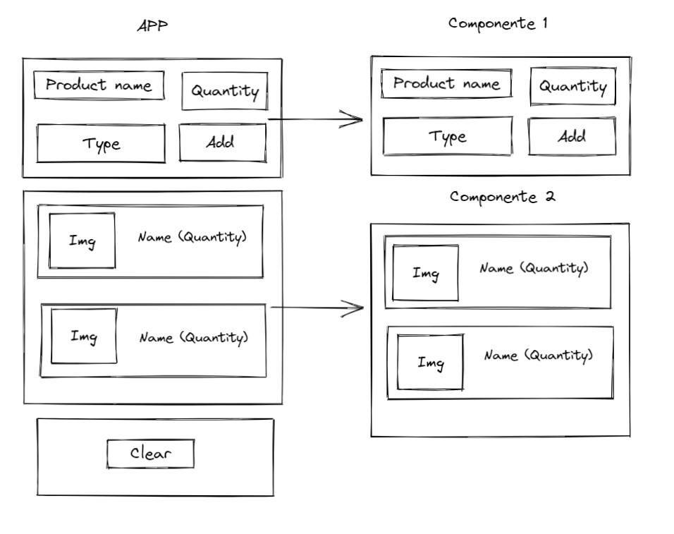
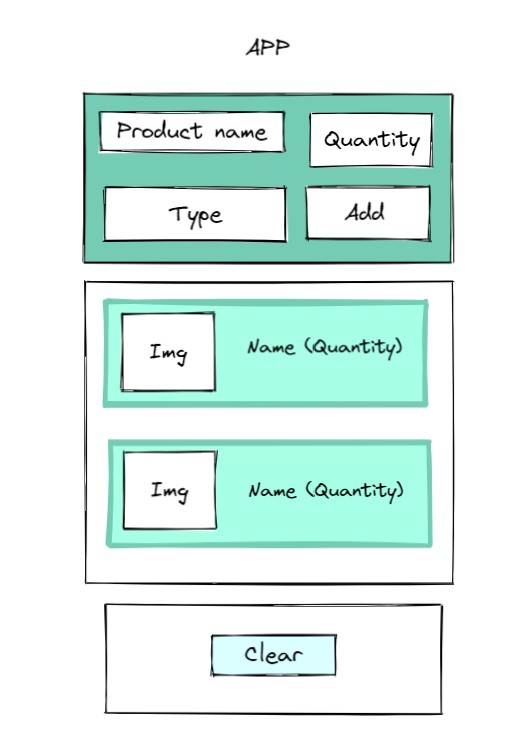

# ShoppingList

En este proyecto se creara una lista de supermercado 
1. El usuario podrá meter productos (el nombre, la cantidad y el tipo)
2. Cuando el usuario ingrese un producto a su carrito este se tachara o cambiara de color 
3. por ultimo se creara un botón para eliminar todos los productos de la lista (Clear)

## Estructura de la app

## Estructura de la app

## Paginas web
https://excalidraw.com/